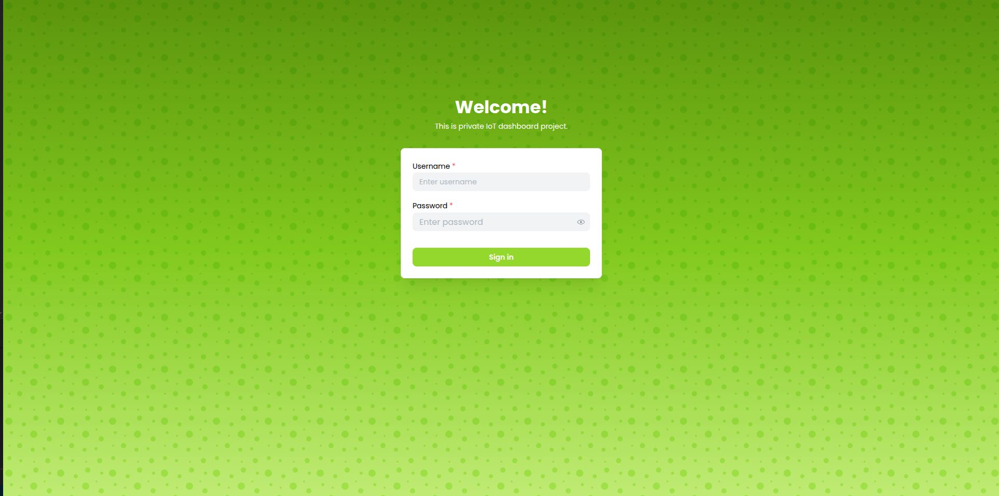
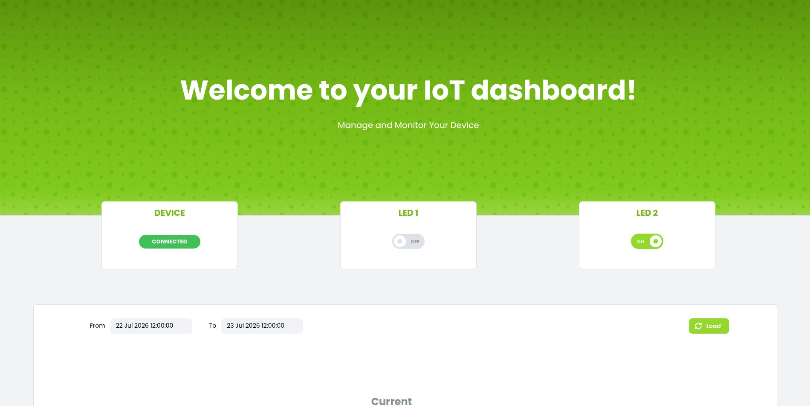
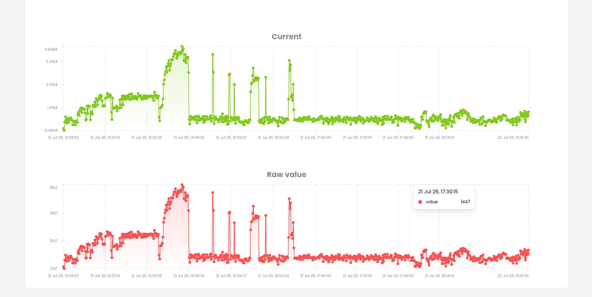
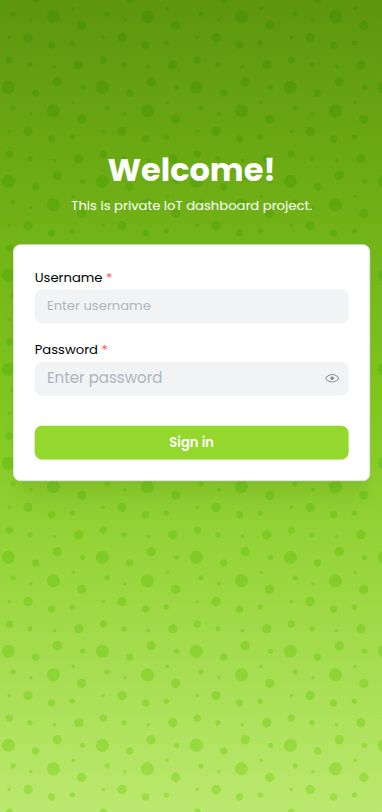
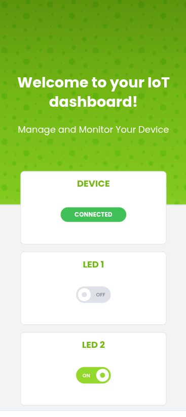

# Remote Lighting Control System – Frontend

This repository contains the frontend application of the **Remote Lighting Control System**. It provides a web interface for monitoring the system and remotely controlling lighting devices through the backend API.

> **Note**
>
> This project was originally developed as part of a university engineering project and has since been further improved and refactored.

---

## Related Repositories

- 🔗 **Backend:** [https://github.com/Warrioll/Remote-Lighting-Control-System-Backend](#)
- 🔗 **IoT Firmware:** [https://github.com/Warrioll/Remote-Lighting-Control-System-IoT-Firmware](#)

---

## Application Preview

The web application provides a user interface for remote lighting control, system monitoring, and real-time visualization of data received from IoT devices.

### Desktop View







### Mobile View


|  |  |
|------------|-------------|
   |   |


## Requirements

Before running the application, ensure the following software is installed and running:

- Node.js (recommended version **25**)
- Backend application
- MQTT Broker
- MongoDB

---

## Getting Started

### 1. Configure environment variables

Create a `.env` file in the project root based on:

```text
.env.frontend.example
```

Fill in all required environment variables.

### 2. Install dependencies

```bash
npm install
```

### 3. Start the development server

```bash
npm run dev
```

The application will be available at:

```
http://localhost:3000
```

---

## Technologies

- React
- Vite
- TypeScript
- REST API
- WebSocket